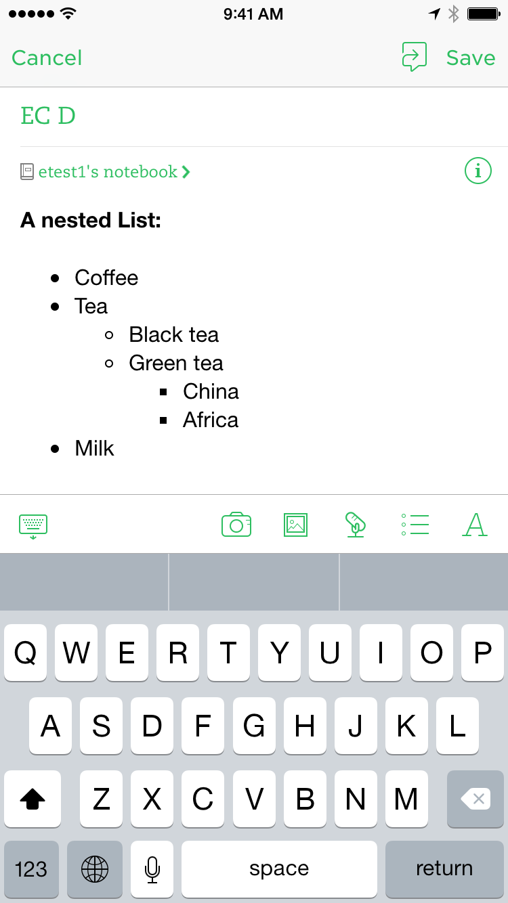
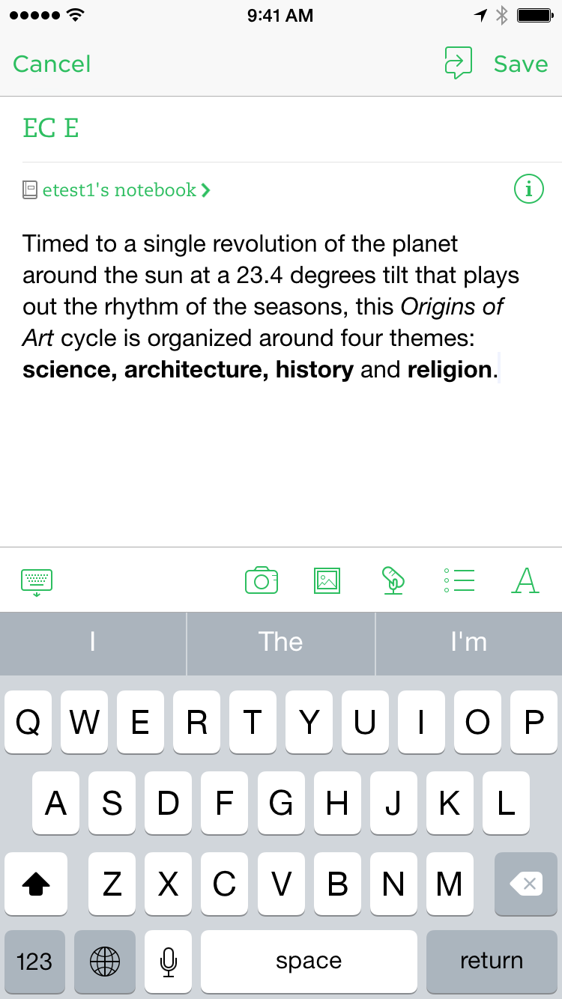
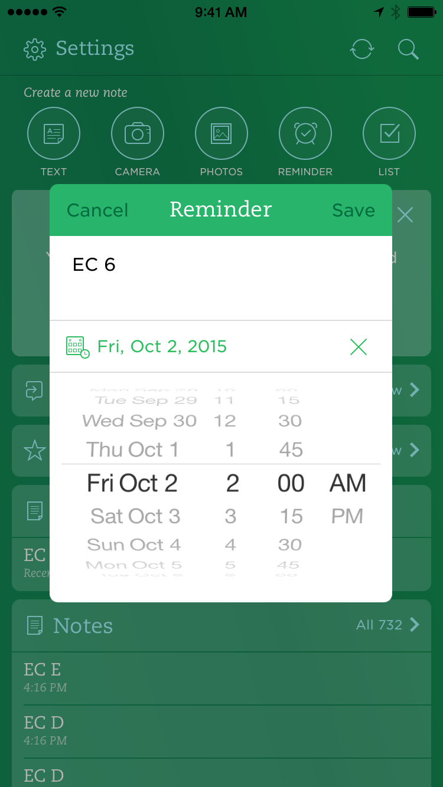
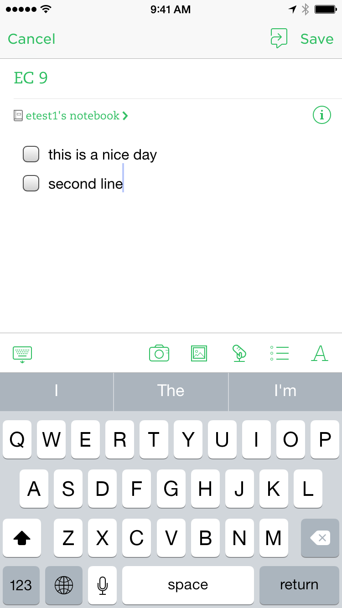
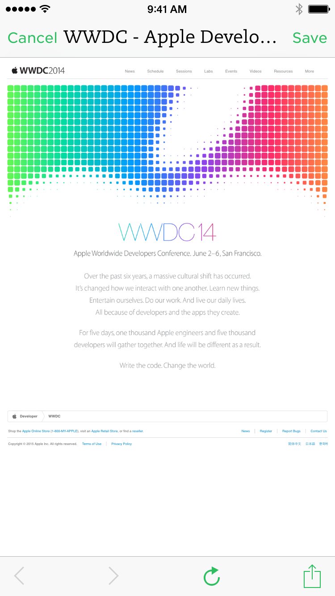

# Examples

Create a note
```
evernote://x-callback-url/new-note
```

Create a note with title 'EC 3' (URL encoded)
```
evernote://x-callback-url/new-note?type=text&title=EC%203
```

Create a note with title ‘EC 4’ and content ‘this is a great day’
```
evernote://x-callback-url/new-note?type=text&title=EC%204&text=this%20is%20a%20great%20day
```

Create a note with title ‘EC D’ and [html content](sample1.html)
```
evernote://x-callback-url/new-note?type=html&title=EC%20D&text=%3C!DOCTYPE%20html%3E%0A%3Chtml%3E%0A%3Cbody%3E%0A%0A%3Ch4%3EA%20nested%20List%3A%3C%2Fh4%3E%0A%3Cul%3E%0A%20%20%3Cli%3ECoffee%3C%2Fli%3E%0A%20%20%3Cli%3ETea%0A%20%20%20%20%3Cul%3E%0A%20%20%20%20%3Cli%3EBlack%20tea%3C%2Fli%3E%0A%20%20%20%20%3Cli%3EGreen%20tea%0A%20%20%20%20%20%20%3Cul%3E%0A%20%20%20%20%20%20%3Cli%3EChina%3C%2Fli%3E%0A%20%20%20%20%20%20%3Cli%3EAfrica%3C%2Fli%3E%0A%20%20%20%20%20%20%3C%2Ful%3E%0A%20%20%20%20%3C%2Fli%3E%0A%20%20%20%20%3C%2Ful%3E%0A%20%20%3C%2Fli%3E%0A%20%20%3Cli%3EMilk%3C%2Fli%3E%0A%3C%2Ful%3E%0A%0A%3C%2Fbody%3E%0A%3C%2Fhtml%3E%0A
```
Evernote action  


Create a note with title ‘EC E’ and [html content](sample2.html)
```
evernote://x-callback-url/new-note?type=html&title=EC%20E&text=%3C!DOCTYPE%20html%3E%0A%3Chtml%3E%0A%09%3Chead%3E%0A%09%09%3Ctitle%3EInline%20Elements%3C%2Ftitle%3E%0A%09%3C%2Fhead%3E%0A%09%3Cbody%3E%0A%20%20%20%20%09%09%3Cp%3E%0A%09%09%09Timed%20to%20a%20single%20revolution%20of%20the%20planet%20around%20the%20sun%20at%20a%2023.4%20degrees%20tilt%20that%20plays%20out%20the%20rhythm%20of%20the%20seasons%2C%20this%20%3Cem%3EOrigins%20of%20Art%3C%2Fem%3E%20cycle%20is%20organized%20around%20four%20themes%3A%20%3Cb%3Escience%2C%20architecture%2C%20history%3C%2Fb%3E%20and%20%3Cb%3Ereligion%3C%2Fb%3E.%0A%09%09%3C%2Fp%3E%0A%09%3C%2Fbody%3E%0A%3C%2Fhtml%3E
```
Evernote action  


Create a note with content ‘this is an nice day’, location of Eiffel Tower in Paris, success callback url ```enbrigetest://success```, cancel callback url ```enbridgetest://cancel``` and error url ```enbridgetest://error```
```
evernote://x-callback-url/new-note?type=text&text=this%20is%20a%20nice%20day&latitude=48.85837&longitude=2.294481&x-success=enbridgetest%3A%2F%2Fsuccess&x-error=enbridgetest%3A%2F%2Ferror&x-cancel=enbridgetest%3A%2F%2Fcancel
```

Create a note with content ‘this is a nice day’, location of Eiffel Tower in Paris, reminder on Fri, 02 Oct 2015 09:00:00 GMT and callback URLs same as above
```
evernote://x-callback-url/new-note?type=text&text=this%20is%20a%20nice%20day&latitude=48.85837&longitude=2.294481&reminderdate=1443776400&x-success=enbridgetest%3A%2F%2Fsuccess&x-error=enbridgetest%3A%2F%2Ferror&x-cancel=enbridgetest%3A%2F%2Fcancel
```

Create a quick reminder note with title ‘EC 6’, content ‘this is a nice day’, location, reminder time, callback URLs same as above
```
evernote://x-callback-url/new-note?type=reminder&title=EC%206&text=this%20is%20a%20nice%20day&latitude=48.85837&longitude=2.294481&reminderdate=1443776400&x-success=enbridgetest%3A%2F%2Fsuccess&x-error=enbridgetest%3A%2F%2Ferror&x-cancel=enbridgetest%3A%2F%2Fcancel
```
Evernote action  


Create a camera note (note editor will launch camera to take pictures) with title ‘EC 7’, content ‘this is a nice day’, location and callback URLs same as above
```
evernote://x-callback-url/new-note?type=camera&title=EC%207&text=this%20is%20a%20nice%20day&latitude=48.85837&longitude=2.294481&x-success=enbridgetest%3A%2F%2Fsuccess&x-error=enbridgetest%3A%2F%2Ferror&x-cancel=enbridgetest%3A%2F%2Fcancel

```

Create a photo note (note editor will launch image picker) with title ‘EC 8’, content ‘this is a nice day’, location, and callback URLs same as above
```
evernote://x-callback-url/new-note?type=photos&title=EC%208&text=this%20is%20a%20nice%20day&latitude=48.85837&longitude=2.294481&x-success=enbridgetest%3A%2F%2Fsuccess&x-error=enbridgetest%3A%2F%2Ferror&x-cancel=enbridgetest%3A%2F%2Fcancel
```

Create a todo list note with the to do items ‘this is a nice day’ and 'second line', title ‘EC 9’, location of Eiffel Tower in Paris, callback URLs same as above
```
evernote://x-callback-url/new-note?type=list&title=EC%209&text=this%20is%20a%20nice%20day&latitude=48.85837&longitude=2.294481&x-success=enbridgetest%3A%2F%2Fsuccess&x-error=enbridgetest%3A%2F%2Ferror&x-cancel=enbridgetest%3A%2F%2Fcancel
```
Evernote action  


Create an audio note (note editor will launch microphone to record audio) with title ‘EC A’, content ‘this is a nice day’, location and callback URLs same as above
```
evernote://x-callback-url/new-note?type=audio&title=EC%20A&text=this%20is%20a%20nice%20day&latitude=48.85837&longitude=2.294481&x-success=enbridgetest%3A%2F%2Fsuccess&x-error=enbridgetest%3A%2F%2Ferror&x-cancel=enbridgetest%3A%2F%2Fcancel
```
Evernote action  


Create a new note with content from clipboard, title ‘EC B’, location and callback URLs same as above
```
evernote://x-callback-url/new-note?type=clipboard&title=EC%20B&latitude=48.85837&longitude=2.294481&x-success=enbridgetest%3A%2F%2Fsuccess&x-error=enbridgetest%3A%2F%2Ferror&x-cancel=enbridgetest%3A%2F%2Fcancel
```

Create a new note with the content as last photo from the camera roll (could be screenshot or photo), title ‘EC C’, location and callback URLs same as above
```
evernote://x-callback-url/new-note?type=lastphoto&title=EC%20C&latitude=48.85837&longitude=2.294481&x-success=enbridgetest%3A%2F%2Fsuccess&x-error=enbridgetest%3A%2F%2Ferror&x-cancel=enbridgetest%3A%2F%2Fcancel
```

Create a new note with content from page https://developer.apple.com/wwdc/ to clip, callback URLs same as above
```
evernote://x-callback-url/new-clipped-note?url=https://developer.apple.com/wwdc/&x-success=enbridgetest%3A%2F%2Fsuccess&x-error=enbridgetest%3A%2F%2Ferror&x-cancel=enbridgetest%3A%2F%2Fcancel
```
Evernote action  

