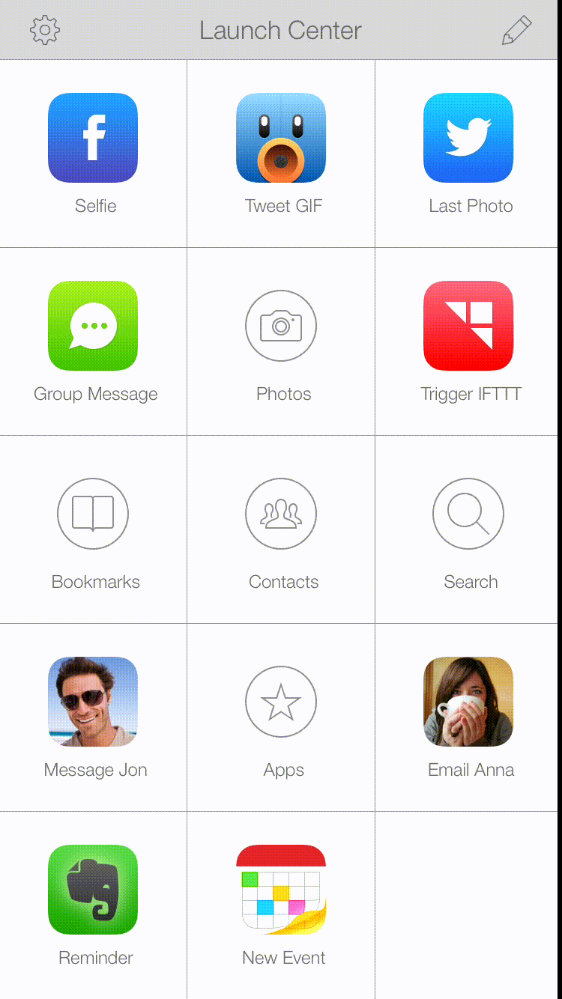

# Evernote iOS x-callback-url support

Evernote iOS app started supporting x-callback-url from version 7.5. Some apps are already using this integration, like [Launch Center Pro](https://itunes.apple.com/us/app/launch-center-pro/id532016360?mt=8) and [Drafts 4](https://itunes.apple.com/us/app/drafts-4-quickly-capture-notes/id905337691?mt=8).  
Here's an example in [Launch Center Pro](https://itunes.apple.com/us/app/launch-center-pro/id532016360?mt=8)  
  
[Phillip Gruneich](https://twitter.com/pgruneich) wrote a great [article](https://onetapless.com/exploring-evernote-xcallbackurl) about x-callback-url support in Evernote iOS and wonderful things we can accomplish with this. I recommend you read it [here](https://onetapless.com/exploring-evernote-xcallbackurl).  
This repo serves as the documentation. Feel free to file a bug or a feature request on this Github repo.

## Overview

Extensions in iOS 8 and OS X Yosemite makes integrations between apps easier than ever. But according to WWDC 2014, URL schemes is still the recommended way to do inter-app communication. [x-callback-url](http://x-callback-url.com/) is a popular solution in the iOS community and there're [a lot of apps](http://x-callback-url.com/apps/) that's adopting it.

## Scheme

Following the [specs](http://x-callback-url.com/specifications/), the x-callback scheme in Evernote iOS is
```
evernote://x-callback-url/[action]?[action parameters]&[x-callback parameters]
```
You can integrate with Evernote iOS app with literally one line of Objective-C code, for example:
```objective-c
[[UIApplication sharedApplication] openURL:[NSURL URLWithString:@"evernote://x-callback-url/new-note?type=text&title=EC%204&text=this%20is%20a%20great%20day"]];
```
Or Swift, if you like
```swift
UIApplication.sharedApplication().openURL(NSURL(string: "evernote://x-callback-url/new-note?type=text&title=EC%204&text=this%20is%20a%20great%20day"))
```

**Note: the parameters are URL encoded**

## Protocol
x-callback-url protocol is defined in http://x-callback-url.com/

## Actions
### /new-note
Create a new note

_**Parameters**_
* type *optional STRING*  
Can be one of {text, html, camera, photos, reminder, list, audio, clipboard, lastphoto}. Check out the [URL scheme examples](Examples.md) to understand the differences between those types.

* title *optional STRING*  
Title of the new note

* text *optional STRING*  
Text to append to the note  
**When note type is html, make sure the text is sanitized html string and no external resources  
When note type is text, camera, photos, list and audio, only plain text is supported  
Other note type this parameter is ignored**

* longtitude *optional DOUBLE*  
Longtitude value of the new note

* latitude *optional DOUBLE*  
Latitude value of the new note

* reminderdate *optional DOUBLE*  
The due date of the new reminder, expressed in number of seconds from the first instant of 1 January 1970, GMT. Use to set an absolute due date for the reminder. You can get the value from```[NSDate timeIntervalSince1970]```

### /new-clipped-note
Create a new note from URL in clipboard

_**Parameters**_
* url *required STRING*  
The URL to clip

## x-callback parameters
_**This is optional but recommended for better user experience**_

x-callback-url defines several parameters with specific purposes, all of which are optional. These parameters should be passed as query args in the URL, in the format ```key1=value1&key2=value2```. All values should be URL encoded strings. You should use these parameters to provide callback URLs of your app, and handle success/cancel/error completion cases in the app delegate.

* **x-success** : URL to open on completion of saving a note. If not provided, the user will stay in the Evernote app after the action is successfully completed.

* **x-cancel** : URL to open if the requested action is cancelled by the user. If not provided, the user will stay in the Evernote app after the action is cancelled.

* **x-error** : URL to open if the requested action generates an error or failed to complete. In such case, Evernote app will report the failure to the user, log the error in App Log (On Evernote iOS, Settings->Support->Activity Log) and return to the source app. If not present, user will stay in the Evernote app.

## Examples
Check out [URL scheme examples](Examples.md)
